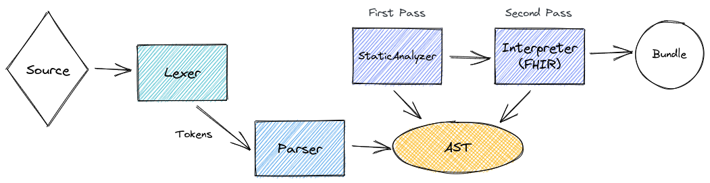
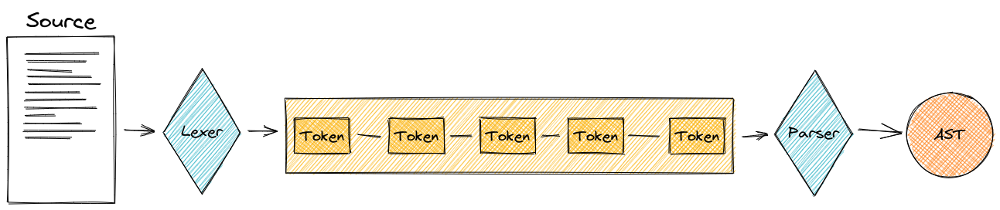
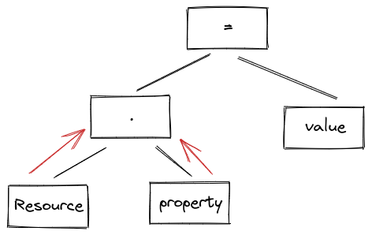
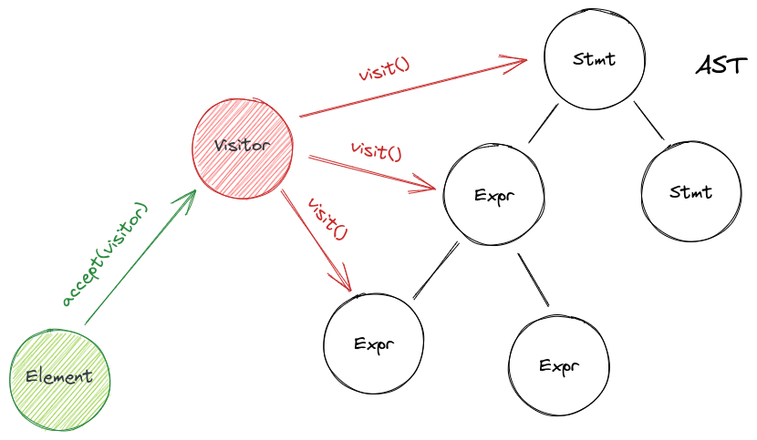
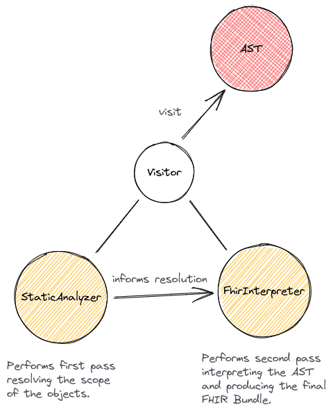

# FHIR Definition Language (FDL) POC

This POC investigates and demonstrates how it is possible to create a custom Domain Specific Language (DSL) to allow HC
Consultants to autonomously define FHIR resources mapping the keys of extracted documents. The POC is fairly complex,
but it is complete of unit and integration tests and should be "simple" to transition it to production code.

## FDL Grammar

This is FDL grammar definition in a modified version of Backus-Naur form (BNF), with a simplified syntax (since FDL
parser will not be automatically generated).

```
program     -> statement+ EOF ;
statement   -> expression ";" ;
expression  -> assignment ;
assignment  -> deference "=" primitive ;
deference   -> receiver "." IDENTIFIER ("[" NUMBER "]")? ;
receiver    -> declaration | STRING ;
primitive   -> typedef | assignment ;
typedef     -> "(" STRING "as" (type | ("date" ("=>" STRING)?)) ")" ;
declaration -> ELEMENT ("[" matcher "]")? ;
type        -> "boolean" | "date" | "decimal" | "integer" ;
matcher     -> NUMBER | STRING ;
```

## FDL Language

A listing of FDL comprises multiple expressions. The most simple expression is the instantiation of a FHIR resource:

```
Patient;
```

This will produce an empty _Patient_ FHIR resource.

Every statement ends with a semicolon (`;`) and is insensitive to spaces or newlines, so it can be formatted freely.

#### Comments

Comments can be marked using `//`. All the characters from the comment mark to the end of the line will be ignored:

```
// This is a comment.
Patient.active="true";
```

### Matched Resources

A single statement can declare multiple resources. Resources can be matched appending brackets with a _matcher_ to the
resource name. This will produce two `Patient` resources:

```
Patient[0];
Patient[1];
Patient[1];
```

The matcher can be a _number_, or a _string_, so the following are all valid declarations and will produce three
resources:

```
Practictioner[123];
Practictioner["specialist"];
Practictioner["nurse"];
```

If the resource is declared without a matcher, it will default to `[0]`, so `Patient` will be equivalent to `Patient[0]`
. If using a number, bear in mind that it does not represent a cardinality, it is a matcher, so the sequence does not
matter, and the declaration can start at whatever number.

Internally, a number matcher will be handled as a string, so `Patient[1]` and `Patient["1"]` reference the same
resource.

### Attributes

Resources can have attributes, which can be initialized:

```
Patient.active="true";
```

This will create a `Patient` resource with its `active` attribute initialized to `true`. Note that "true" is a string
here, this means it will be evaluated at runtime if the attributes expects a boolean value. Currently, `true`, `yes` and
`y` are translated to `true`, `false`, `no`, `n` are translated to `false`, case-insensitive.

The value assigned must be a _string_, so `Patient.active=true;` will raise an error.

#### List Fields

Some fields have cardinality which can be expressed using a list access notation: `field[index]`. The index must be an
integer number and counting starts at `0` (do not confuse it with the _resource matcher_). Since this maps directly to
the position of the internal list representation, the sequence of numbers **does matter**.

**It is important to respect the order of the indexed fields.** Not starting at `0` or skipping numbers in the sequence
will rise a _runtime error_ and produce an empty Bundle (see Errors).

Since a human can have multiple given names, the following is a valid statement:

```
Practictioner["nurse"].name[0]=HumanName.given[0]="Emily";
```

If the cardinality is not specified, it will default to `[0]`.

#### Simplified Notation

FDL offers a _simplified notation_. The _standard notation_, requires that the FHIR element type is specified in
recursive assignments, such as:

```
Practictioner["nurse"].name[0]=HumanName.given[0]="Emily";
```

_Simplified notation_, allows not to specify assigned elements. The following is equivalent to the statement above:

```
Practictioner["nurse"].name[0].given[0]="Emily";

// since both fields are at zero position, the following is even simpler
Practictioner["nurse"].name.given="Emily";
```

What happens here is that FDL infers the type of `name` from the context and the instantiation of the `HumanName`
element is implicit if that element doesn't already exist.

Both notations work at the same time and are compatible. It is up to the user to decide which one he/she prefers.

#### 'required' Attributes

The FHIR specification marks as 'required' those attributes that have restricted values, assignable from a list of
predefined elements. From the specification:

> To be conformant, codes in this element SHALL be from the specified value set.

In programming terms they can be associated to _enumerations_, and that is the actual internal representation in FDL.

From a syntax point of view, there is no difference from a normal assignment, but the interpreter will raise an error if
the value is not allowed.

For example `Immunization.status="completed";` is syntactically and semantically valid; `Immunization.status="refused"`
is syntactically valid, but semantically wrong (since "refused" is not a valid value) and will raise a _runtime error_.

#### BackboneElements

In FHIR they are defined as

> The base definition for complex elements defined as part of a resource definition - that is, elements that have
> children that are defined in the resource. Data Type elements do not use this type, though a few data types specialize
> it (Timing, Dosage, ElementDefinition). For instance, `Patient.contact` is an element that is defined as part of the
> patient resource, so it automatically has the type BackboneElement.

In FDL they are easily defined simply referring at them as sub elements:

```
Patient.contact.telecom=ContactPoint.value="12345678";
Patient.contact.telecom=ContactPoint.use="home";
```

Under the hood, the handling is complex, but what is worth knowing from a user standpoint is that the first time a
BackboneElement is accessed, FDL will create its instance.

Of course, _simplified notation_ works here as well:

```
Patient.contact.telecom.value="12345678";
Patient.contact.telecom.use="home";
```

#### Dates

FDL supports dates. If a specific property receives a _date_, for example `Patient.birthDate`, FDL tries its best to
parse the date string.

The following (and many more) formats are parsable:

```
Patient.birthDate="8/27/1969";
Patient.birthDate="Aug 27, 1969";
Patient.birthDate="27 august 1969";
```

### Types (Optional)

FHIR supports various [data types](https://www.hl7.org/fhir/datatypes.html). FDL is conceived to receive only strings as
values (as extracted by the OCR), for this reason, it makes a lot of guess-work trying to interpret the type correctly.

When assigning to field, it is possible to _optionally_ specify the type of the value. Again, it is optional, but if
done, it will help the interpreter to reduce possible type mismatches, and it makes the processing faster since all the
guess work is skipped.

Note that if the wrong type is declared, the interpreter will try to guess before giving-up.

The syntax to specify a type is `("value" as type)`. Supported types are:

- `boolean`
- `date`
- `decimal`
- `integer`

To implement (refer to FHIR specification to decide which are worth implementing):

- `instant`
- `dateTime`
- `time`

#### Boolean Type

To specify a `boolean`:

```
Patient.active=("yes" as boolean);
```

#### Date Type

To specify the type, the syntax is as follows:

```
Patient.birthDate=("8/7/1978" as date);
```

Optionally, it is possible to also specify the date format (ex. if it uses uncommon separators) using the _fat arrow_
operator '=>':

```
Patient.birthDate=("7.8/1979" as date => "M.d/yyyy");
```

#### Decimal and Integer

If the FHIR attribute takes a `decimal` or a `integer`, it can be specified with:

```
Goal.target.detail=("10" as integer);
Quantity.value=("11.2" as decimal);
```

### Errors

FDL raises two kinds of errors: _static errors_ and _runtime errors_.

#### Static Errors

Are raised during the lexing and parsing phases. These are mostly syntax errors, for example mismatched brackets,
unexpected elements at certain positions and so on. These errors do not block the parsing phase, but are collected and
reported all together to facilitate fixing.

#### Runtime Errors

These errors are raised during the interpretation phase, and are semantic errors, for example declarations of invalid
resources, wrong assignment types etc. All of these errors stop the interpretation, an empty Bundle is produced and the
error is reported.

## FDL SpitFHIR Wrapper

FDL is implemented as a generic embeddable language, but it is primarily intended to be integrated into SpitFHIR.
SpitFHIR will receive a list of key/value pairs where _key_ is the FDL statement and _value_ is the extracted data. To
reference _value_ in the statement, FDL uses a `$` (dollar sign).

For example:

```json
{
  "Patient.active=$;": "yes",
  "Patient.name[0]=HumanName.family=$;": "Smith",
  "Patient.birthDate=($ as date);": "8/7/1980"
}
```

will be hydrated into:

```
Patient.active="yes";
Patient.name[0]=HumanName.family="Smith";
Patient.birthDate=("8/7/1980" as date);
```

and then interpreted as explained above.

Note that `$` will automatically add double quotes to the value, so it is not necessary to add them (adding them will
produce unexpected results).

## Implementation

FDL is implemented in a classic `Lexer` -> `Parser` -> `StaticAnalyzer` -> `Interpreter` style.



### Lexer and Parser

The `Lexer` scans a source string and produces a list of `Token`; the `Parser` receives the list of `Token` and builds
an _Abstract Syntax Tree_. The parsing produces an AST meant to be interpreted in
_[recursive descent](https://handwiki.org/wiki/Recursive_descent_parser)_ (other approaches may be evaluated, such
as _[Pratt algorithm](https://handwiki.org/wiki/Pratt_parser)_, maybe associated with a bytecode base VM).



### Abstract Syntax Tree

The _[Abstract Syntax Tree](https://en.wikipedia.org/wiki/Abstract_syntax_tree)_ is a tree data structure where each
node represents a _statement_ or an _expression_. The AST allows keeping track of the order of the evaluation of the
expression, enforcing operator precedence and associativity.



Writing an AST data structure by hand is tedious and error-prone. The AST data structure of FDL is generated via
metaprogramming. A grammar definition YAML file is included in the project and, upon compilation, the `Expr` and `Stmt`
classes are generated. The plugin is a submodule of this project.

### The Visitor Pattern

To navigate the AST and perform the operation required for each node, FDL makes use of a
_[Visitor](https://refactoring.guru/design-patterns/visitor)_ pattern. The _Visitor_ pattern allows to put the logic
into a separate class, instead of integrating it into each node.



In FDL implementation, the _Visitor_ is coded in two analogous `abstract` classes: `Expr` and `Stmt`. Each of them
represents the _Element_ of the _Visitor_ pattern, and each of them also declares `Visitor` as a sub-interface. Also,
each AST node class is declared as a sub-class of `Expr` or `Stmt`.

### Interpretation

Both `StaticAnalyzer` and `Interpreter` implement the _Visitor_ and define each method required to visit each node,
performing their own logic.



The `StaticAnalyzer` is the first pass on the AST and performs the static analysis. In particular, it resolves the
generated objects in a way that the `Interpreter` can leverage to know exactly each object "which" object is.

The `Interpreter` is the second pass on the AST and performs the actual interpretation and production of the FHIR
resources and the final Bundle. It makes heavy use of Java reflection to generate FHIR resources using the HapiFHIR
library.

### Maven AST Generator Plugin

The plugin is a Mojo that hooks in the _generate-sources_ phase, parses the source YAML grammar definition file and
generates the AST data structure (definition of `Visitor`, the two _Elements_ classes `Stmt` and `Expr` and the
definition of each supported node).
